# SQL and Databases

## Why not use Excel for everything?

  * READ: http://schoolofdata.org/2013/11/07/sqldatabases-vs-excel/  
  * It doesn’t scale well to large data or multiple tables  
  * Doesn’t allow working with multiple datasets easily (VLOOKUP is a hack to help fix this)  
  * Mistakes are easy - just one cell formula error and you are toast.  
  * Collaboration is hard. Copies of spreadsheets are scary.

## What’s a Database?
Here's a picture of a server, like MySQL or PostgresQL, that you connect to with a “client.”

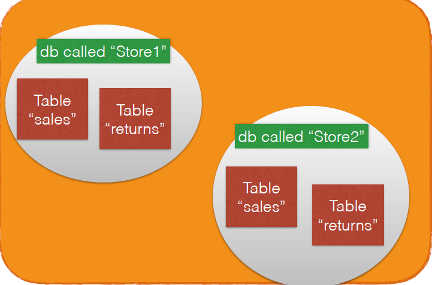

**A server may contain several databases. Each database has tables in it, with columns. Each table is like an Excel sheet of raw data.**

A Good Overview Article (way more technical than we need)
http://www.elated.com/articles/mysql-for-absolute-beginners/

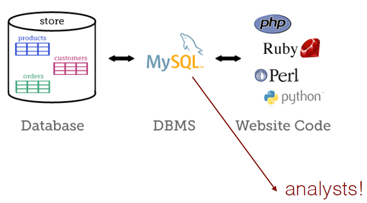

## SQL database structure
  * Like Excel, you have tables with columns and rows
  * SQL tables are ideally “long” and “tidy” data —
each row is a data row, each column is a variable
  * It’s better to have more tables and do joins than try
to squeeze everything into one table.
  * You can get your results out of a SQL query as a cvs file to do graphs in Excel. This is a common workflow.

## Database design
  * Read http://joshualande.com/database-normalization

  * One “topic” per table. That way fewer errors occur
when changes in the data happen.

## SQL varieties
  * MySQL - opensource, more common in startups
  * T-SQL (Microsoft server sql) - common in biz
  * PostgresQL (better for text, big data, json…) - also
common in data science startups
  * SQLite - runs without a real “server” (more simple to
install and run, e.g., in browser or apps)

We won't be creating tables in class but you can read http://joshualande.com/create-tables-sql.  
Also, note that some clients allow you to do it with cvs data.

## Simple queries
  * Do the tutorial in https://sqlbolt.com/lesson/select_queries_introduction - you will do Lessons 1-4 on Simple Select queries, filtering, and constraints. This will allow you to do the HW.

  * Single table queries - with filters, limits, and ordering:

Interested in more practice ? Try the lessons here http://www.w3schools.com/sql/sql_intro.asp

## For class: SQLite
Install a SQLite GUI: SQLite Studio works on all platforms: http://sqlitestudio.pl/  
After installing, add the db Chinook.db. You must navigate to it on your hard drive -Chinook.db.

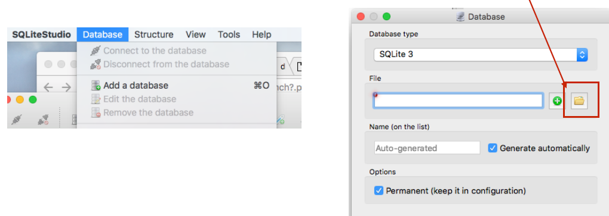

After you add it, click on it. Afterwards, click on the “Connect” icon.

  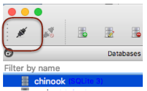

You should see this:

  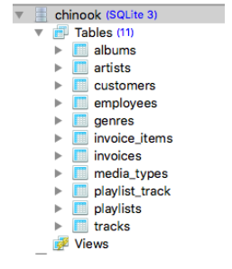

**Inspect the tables**  
Double click on a table to see the structure and data.

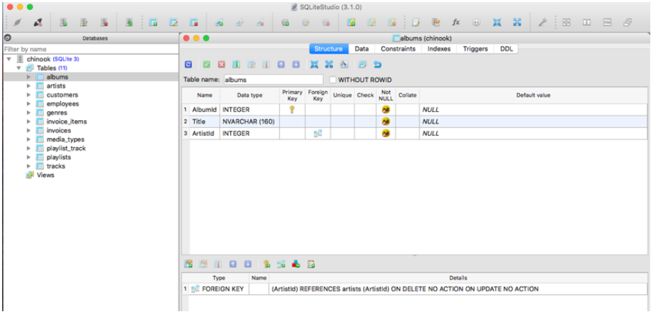

## Data Types
  * There seem to be 2 sets of tables in this db - sales related items (employees, customers, invoices,
invoice_items) and musician items (albums, artists, genres, media_types, playlist_track, playlists, and tracks).

  * What are the relationships between the tables for the invoices items? Find the “foreign keys.” These tie tables together.

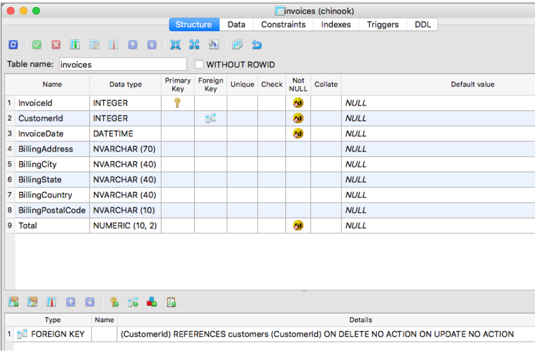

“CustomerId” references Customer - another table.

## Data tab
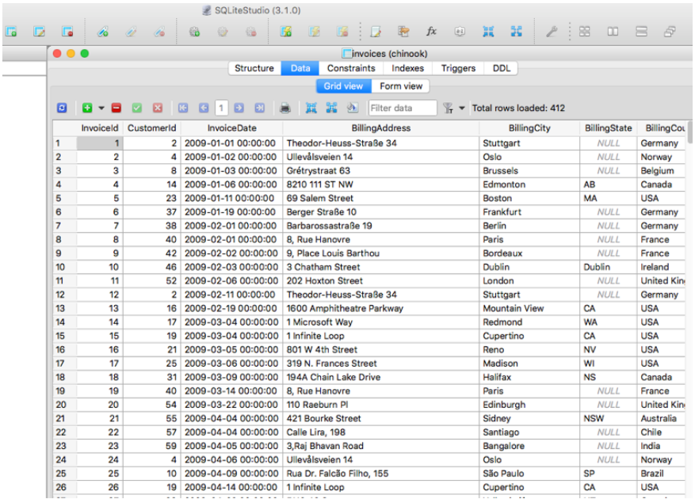

  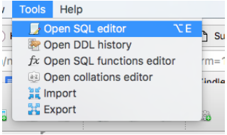

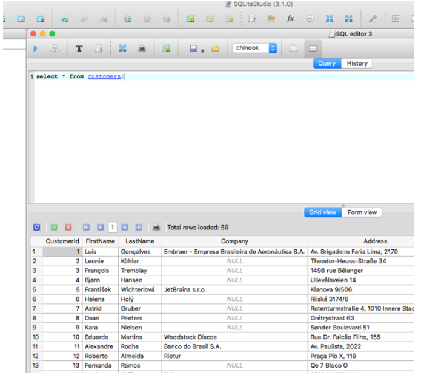

Make sure you are using your database…   
If you have multiple “loaded”:

  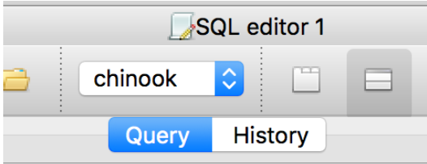

## Export to Excel
This GUI client requires you to redo the query in an export dialog. (Others allow you to export as CSV
right from the results.) Check Column names in first row! Tab as separator is safest.
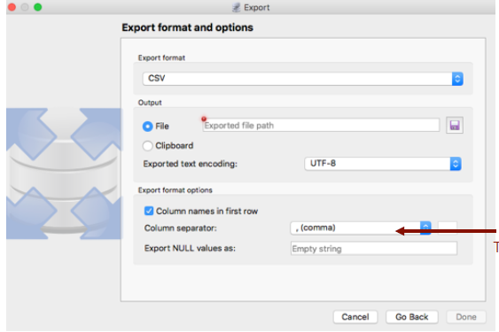

It shows *comma* (,) but you should choose Tab. Then read it as an external text file in Excel, with Tab as your delimiter.

## Warning
Data you export from these SQL tables will be in International
numeric format, not Euro/French. Your best bet is to use import
txt file and set your number format during the import wizard.
Also set the date format.
In class homework requires this export….
