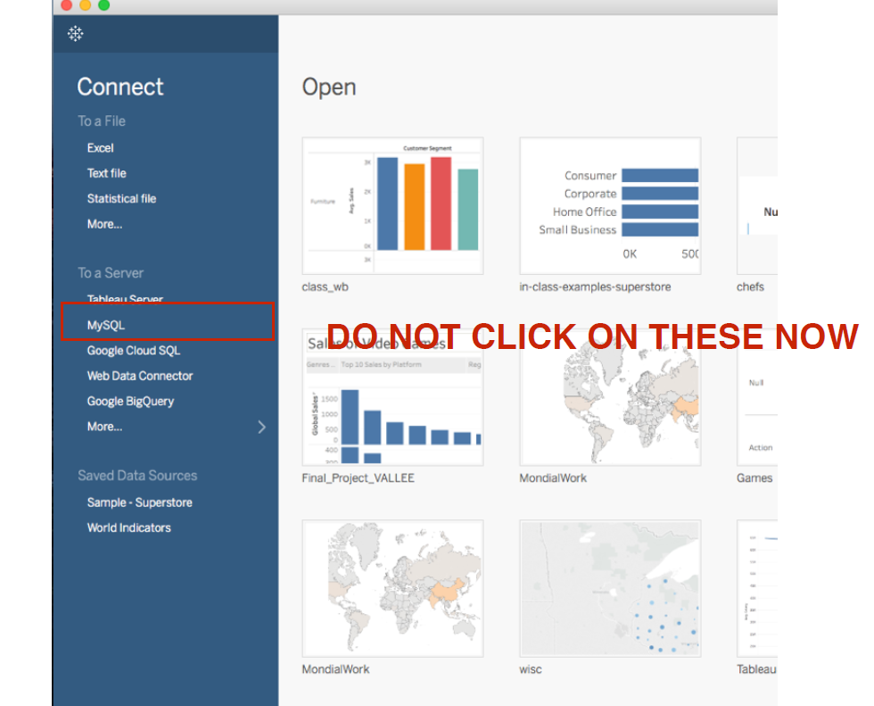

# Tableau with SQL

**Make sure you also have a SQL client, e.g : MySQL Workbench (both platforms) : https://www.mysql.fr/products/workbench/**

### Setting up the connection
Let's now add a connection. Our SQL host informations are :
* Server : analyst-toolbelt.cn119w37trlg.eu-west-1.rds.amazonaws.com
* Username : emlyon1 or emlyon2
* Password : student1 or student2

### Drivers download
You might need to install drivers.
You will get a link to download them - pick your
platform and choose your connection type.

## Start working !
### Multiple Joins
Once you're connected, pick employees :

When you go to a sheet to make a chart, change employee number to a dimension. Since it's not a “value” but an id number, you can’t do math
on it.

Now perform the multiple joins :

Check out the rows carefully, what happened ? How can you handle that in your graphs ?

### Work on 'Titles'
First, make a chart showing how many employees have each title.

Why is it cnt(emp no)?

Now duplicate that sheet and do avg(salary) by title.

Right click under Measures and pick “Create Calculated Field”.

### Working on Dates
Create a new measure for Date Differences in Tableau: http://kb.tableau.com/articles/knowledgebase/differencedates-one-date-field.

    
Now use a ShowMe histogram to check this data : On a blank sheet, open show me and click on your new Measure (“Time in Dept”).     

      
You must have this :

   
Weird results. What’s going on? Go back to your original data.

Their “to_date” is impossible - it must mean “still employed.”     
   
You might need to filter these values out.

### Adding a data source to a database
Let's add a data source for *movies*.    

Pick movies.    
    
But if you try to make a chart, it’s really slow :(

  
Make sure you preview your results before you hit ok.

### Back to queries
**Do a query for movies with the word “Action” in their Genres.**  
After it succeeds, join with Ratings (you need to fix Ratings so it's decimal !).  
Filter so that there are at least 5 ratings per movie in your chart.

 ***
Note that you can have multiple data connections
and queries in one workbook.
Use the menu by the disk on the right to connect to a new table/query/db. You might want to name it!

    
Tip: Use a SQL client while you use Tableau, so you can more easily understand what’s in your tables and how they related.
